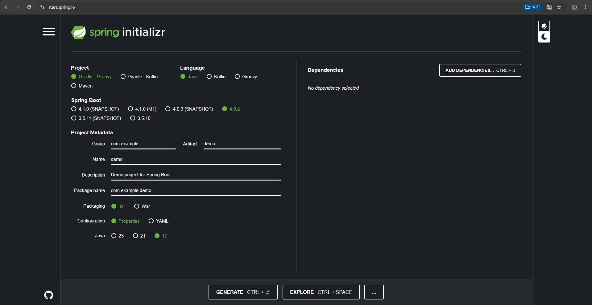
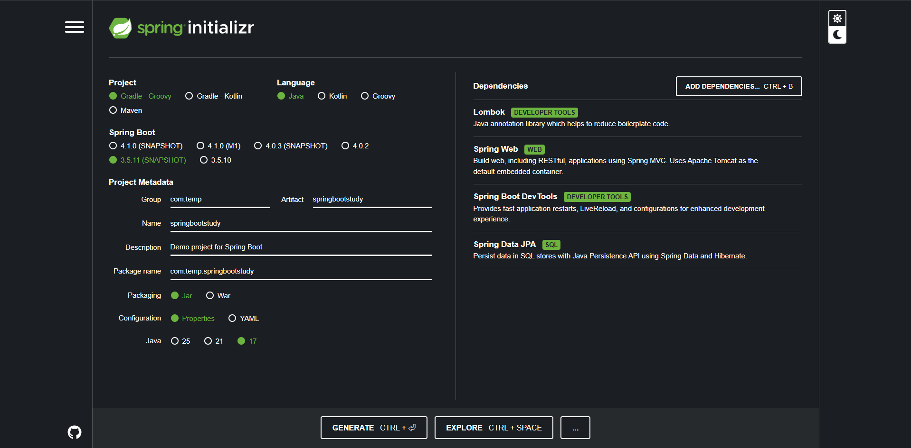
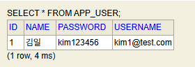

# DDL

## CREATE : 테이블 생성
- 테이블을 만들 떄는 각 컬럼의 데이터의 타입과 제약조건을 설정할 필요있음.
```sql
-- 1. CREATE : 테이블 생성
CREATE TABLE students (
	student_id INT AUTO_INCREMENT PRIMARY KEY,
	full_name VARCHAR(50) NOT NULL,
	email VARCHAR(100) UNIQUE,
	birth_date DATE,
	created_at TIMESTAMP DEFAULT CURRENT_TIMESTAMP
);
```

## ALTER : 테이블 수정
- 이미 만들어진 테이블에 새로운 컬럼을 추가하거나 타입을 변경할 떄 사용
```sql
-- 컬럼을 추가할 떄
ALTER TABLE students ADD phone VARCHAR(20);

-- 컬럼 데이터 타입 수정
ALTER TABLE students MODIFY COLUMN full_name VARCHAR(100);
```

## DROP : 테이블 삭제
- 테이블 자체를 완전히 삭제(복구가 어렵기 때문에 주의해야 합니다).
```sql
-- 테이블 삭제
DROP TABLE students;
```

# DML(Data Manipulation Language)
- 데이터를 직접 조작하는 create(INSERT), read(SELECT), update(UPDATE), delete(DELECT) 단계

## INSERT : 데이터 추가
- 데이터를 삽입할 떄는 컬럼 순서와 데이터 타입을 일치시켜야 함.

```sql
-- row 하나만 삽입한 예시
INSERT INTO students (full_name, email, birth_date)
    VALUES ('김일','kim1@test.com','2026-02-12');

-- 여러 row 한 번에 삽입
INSERT INTO students (full_name, email)
	VALUES('김이','kim2@test,com'),('김삼','kim3@test.com');
```

## UPDATE : 데이터 수정
* 참조 사항 : `WHERE`절 생략시 테이블의 모든 행이 수정됩니다.

```sql
-- UPDATE
UPDATE students SET birth_date = '1990-01-01'
	WHERE student_id = 2; 

UPDATE students SET phone = '010-2966-6302'
 	WHERE student_id = 3;
```

## DELETE : 데이터 삭제
* 참조 사항 : 마찬가지로 `WHERE`을 이용해 특정 row만 삭제해야 합니다. 고유값(PK)의 의미가 중요한 이유입니다.

```sql
-- 삭제할 데이터 student_id = 4
INSERT INTO students (full_name, email, phone)
    VALUES ('실수', 'mistake@test.com', '010-1234-5678');

-- DELETE : 데이터 삭제
DELETE FROM students WHERE student_id = 4;
```

# 통합 과제
1. 이하의 테이블을 생성하시오.
    - courses
        - course_id : 자동증가 적용 / pk 적용 / int
        - course_name : 문자열(100) not null 적용
        - professor  : 문자열(50)
        - credits : int default 3

    - enrollments
        - enrollments_id : 자동증가 적용 / pk 적용 / int
        - student_id : int / fk 적용
        - course_id : int / fk 적용
        - enroll_date : DATE

2. 더미 데이터 삽입
    - courses 테이블에
        - 데이터베이스기초 / 강교수 / 3
        - 자바프로그래밍 / 이교수 / 4
        - 웹디자인 / 박교수 / 2
    
    - enrollments의 student_id / course_id / enroll_date에
        - 1, 1, '2026-02-01'
        - 1, 2, '2026-02-01'
        - 2, 1, '2026-02-02'

```sql
-- 김일 학생이 수강하고 있는 과목을 표시하고 등록 날짜도 표시하고 그 교수 이름도 출력하시오.

SELECT s.full_name, c.course_name, e.enroll_date, c.professor
FROM students s INNER JOIN enrollments e ON s.student_id = e.student_id INNER JOIN courses c ON c.course_id = e.course_id
WHERE s.student_id = 1;


SELECT s.full_name, c.course_name, e.enroll_date, c.professor
	FROM (SELECT full_name, student_id FROM students WHERE student_id = 1)s
	INNER JOIN enrollments e ON s.student_id = e.student_id 
	INNER JOIN courses c ON c.course_id = e.course_id;
```


1. Create (데이터 추가)
문제 1.1: 새로운 학생 '박지민'(park@test.com, 1995-05-05, 010-5555-6666)을 students 테이블에 추가하세요.

```sql
INSERT INTO students (full_name, email , birth_date , phone) VALUES ('박지민','park@test.com', '1995-05-05', '010-5555-6666');
```

문제 1.2: 새로운 과목 '파이썬 프로그래밍'(최교수, 3학점)을 courses 테이블에 추가하세요.

```sql
INSERT INTO courses (course_name, professor, credits) VALUES ('파이썬 프로그래밍','최교수 ', 3);
```

문제 1.3: 방금 추가한 '박지민' 학생이 '파이썬 프로그래밍'과 '데이터베이스기초' 과목을 오늘 날짜로 수강 신청하게 하세요.

주의: SELECT 문으로 먼저 학생과 과목의 ID 번호를 확인한 뒤 INSERT 하세요.

```sql
INSERT INTO enrollments (student_id , course_id , enroll_date) VALUES (4, 4, '2026-02-12');
INSERT INTO enrollments (student_id , course_id , enroll_date) VALUES (4, 1, '2026-02-12');
```


2. Read (데이터 조회)
문제 2.1: '이교수'가 담당하는 모든 과목의 이름을 출력하세요.

```sql
SELECT course_name
    FROM courses
    WHERE professor = '이교수';
```

문제 2.2: 이메일 주소에 'test.com'이 포함된 학생들의 이름과 전화번호를 조회하세요.

```sql
SELECT full_name, phone
    FROM students
    WHERE email LIKE '%test.com';
```

문제 2.3 [JOIN]: 현재 '데이터베이스기초' 과목을 듣고 있는 학생들의 이름과 그들의 수강 신청 날짜를 출력하세요.

```sql
SELECT s.full_name, e.enroll_date
FROM students s INNER JOIN enrollments e ON s.student_id = e.student_id
INNER JOIN (SELECT * FROM courses WHERE course_name = '데이터베이스기초') c ON c.course_id = e.course_id;
```

3. Update (데이터 수정)
문제 3.1: kim2 학생의 전화번호가 010-1597-7533으로 변경되었습니다. 정보를 수정하세요.

```sql
UPDATE students SET phone = '010-1597-7533'
	WHERE full_name = '김이'; 
```

문제 3.2: '웹디자인' 과목의 담당 교수가 '박교수'에서 '김교수'로 변경되었습니다. 과목 정보를 업데이트하세요.

```sql
UPDATE courses SET professor = '김교수'
	WHERE professor = '박교수';
```

문제 3.3: 모든 과목의 학점(credits)을 1학점씩 상향 조정하세요.

```sql
UPDATE courses SET credits = credits + 1;
```

4. Delete (데이터 삭제)
문제 4.1: kim2 학생이 자퇴를 결정했습니다. students 테이블에서 해당 학생을 삭제하세요.

```sql
DELETE FROM students WHERE student_name = '김이';
```

돌발 상황: 만약 삭제 시 외래키 에러가 발생한다면, 왜 발생하는지 설명하고 enrollments 테이블의 데이터를 먼저 삭제한 뒤 다시 시도해 보세요.

enrollments 테이블에서 학생테이블의 기본키를 참조하고 있기때문에 김이 학생의 id가 존재하여 삭제가 되지 않는다.

```sql
DELETE FROM enrollments WHERE student_id = 2; 

후에 다시 

DELETE FROM students WHERE student_name = '김이';

student_id가 2인지 모르기때문에 아래와 같이 작성

DELETE FROM enrollments WHERE student_id = (SELECT student_id
                                                FROM students
                                                WHERE full_name = '김이'); 
```
문제 4.2: 수강 인원이 0명인 과목을 찾아 courses 테이블에서 삭제하세요.

```sql
DELETE FROM courses WHERE course_id NOT IN (SELECT DISTINCT course_id FROM enrollments);
```

- 이상의 경우 sql문만 봤을 때 오류가 발생하는지 여부를 확신할 수 없습니다.

- 이는 GUI 형탤로 FK 제약 조건을 설정했을 떄, update / delete 시에 `RESTRICT`로 설정했기 때문에 실패라고 나온겁니다.

- 그래서 이 수업 이후 부분에서 `CASCADE` 로 설정을 바꿧을 때는 `DELETE FROM students WHERE student_id = 2;`가 아무런 문제 없이 가능합니다.

* FK 제약 조건이 걸려있는 테이블을 sql문으로 생성하기

```sql

```

# springboot

start.spring.io






#  통합 과제 # 3

- AppUser 클래스를 정의하시오.
    1. field 목록
        - id(pk/자동증가/Long)
        - name(String)
        - username(String)
        - password(String)
    
    2. 생성자를 만드시오(JPA에서는 NoArgsConstructor가 필수적입니다.)
    3. SpringBoot 프로젝트 실행시키고
        - id, name, username, passowrd 순으로 1, 김일, kim1@test.com,kim123456 으로 row를 삽입하시오.
        - SELECT * FROM APP_USER; 를 통해 row가 들어가있음을 확인하시오.
        - 캡쳐해서 md 파일에 옮겨놓으시오.

